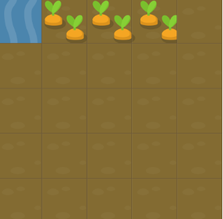
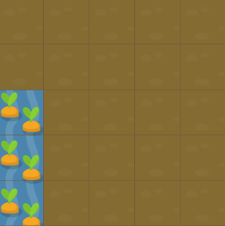
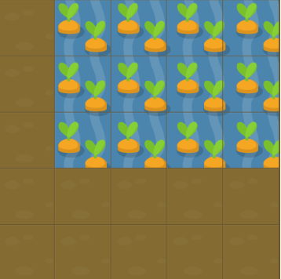
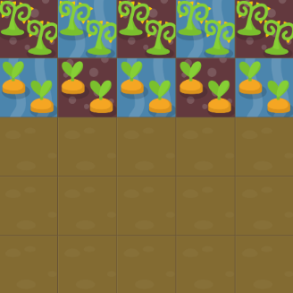
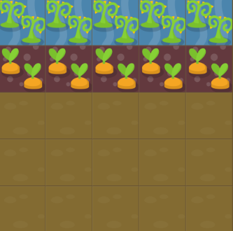
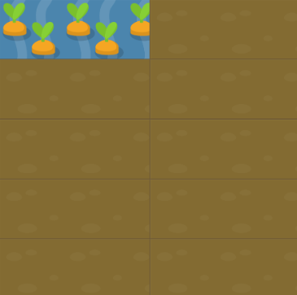
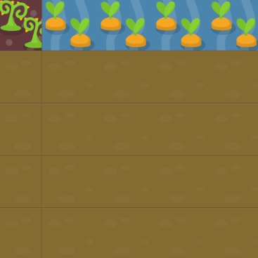
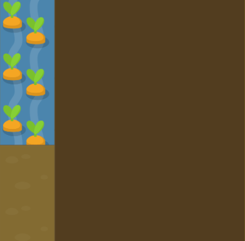

# Webbutveckling grid anteckningar

## grid-column
grid-column-start, grid-column-end och grid-column använder sig alla av linjer, inte lådor när man ska lägga till innehåll.

Dvs att om jag hade velat flytta detta vatten till lådan längst bort så hade jag använt mig av exempelvis grid-column-start: 5 och grid-column-end: 6, eftersom att vattnet ska vara mellan linje 5 och 6.
Alternativt kan jag använda mig av grid-column: 5 / 6 för att förenkla detta. 
(Där 5 är start och 6 är end)
Jag kan även använda mig av grid-column 2 / span 3 för att få en start på linje 2 och sträcka sig 3 snäpp framåt.

## grid-row
grid-row fungerar på exakt samma sätt som grid-column, men är vertikalt istället för lodrätt.

Exempelvis använde jag mig i detta fall av grid-row: 3 / 6

## grid-area
grid-area förkortar grid-column och grid-row ännu mer, så att du kan skriva ner allting på bara en linje av kod. Värdena kommer i följande ordning:
grid-row-start
grid-column-start
grid-row-end
grid-column-end

Nedan ser du ett exempel där jag använde mig av grid-area: 1 / 2 / 4 / 6 för att fylla lådorna med vatten. 

## order
CSS order egenskapen bestämmer i stort sett bara i vilken ordning ett objekt blir arrangerat i grids. Default värdet på order är 0, men vi kan ändra på detta med hjälp av order: (följt av en siffra här).

I detta fall har allting order 0

Om vi skulle sätta order till 1 på gyttjan så händer följande:

Detta innebär att ju lägre en siffra är i order, ju högre prioritet har den.

## grid-template-columns
grid-template columns förklarar alla “lådor” inom en grid ska sitta.

I detta exempel används grid-template-columns: 50% 50% 50% 50% 50%, för att förklara att varenda låda ska täcka 50% av all storlek horisontellt. Man kan alternativt även skriva:
grid-template-columns: repeat(2, 50%) för att förkorta detta.

## Enheten fr
fr sträcks ut över all den möjliga ytan, vilket innebär att man kan använda den för att jämnt fördela ytor, eller proportionellt göra vissa delar större än andra.

Nedan kan en grid ses där grid-template-columns är set till 1fr 5fr, vilket i stort sett betyder att ogräset får ⅙ av all plats medans morötterna får ⅚. 

## grid-template-rows
Fungerar som grid-template-columns. Ett antal värden används för att deklarera hur många föremål som ska finnas och hur stora dessa ska vara.

EX: Jag vill ha 5 styckna lika stora template rows

grid-template-rows: 1fr 1fr 1fr 1fr 1fr; 

ELLER

grid-template-rows: repeat(5, 1fr)

## grid-template
Förkortar ner grid-template-columns och grid-template-rows in i en egenskap, som anges på följande sätt:

grid-template: (grid-template-rows värden) / (grid-template-columns värden);

I detta fall används grid-template: 60% 40% / 200px

